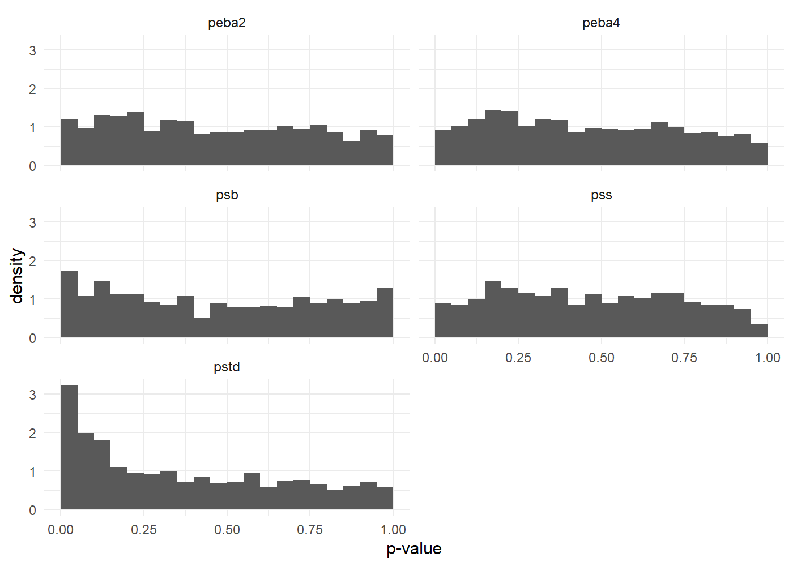

<!-- README.md is generated from README.Rmd. Please edit that file -->

# semselector 

[](https://cran.r-project.org/package=semselector)
[](https://github.com/JonasMoss/semselector/actions)
[](https://www.repostatus.org/#active)
[](https://app.codecov.io/gh/JonasMoss/semselector?branch=main)

An R package for goodness of fit testing of structural equation models

## Installation

Use the following command from inside `R`:

``` r
# install.packages("remotes")
remotes::install_github("JonasMoss/semselector")
```

## Usage

Call the `library` function, create a `lavaan` model, and run the
`semselector` function.

``` r
library("semselector")
model <- "A =~ A1+A2+A3+A4+A5;
          C =~ C1+C2+C3+C4+C5"
n <- 200
object <- lavaan::sem(model, psych::bfi[1:n, 1:10])
pvalues(object)
#>       pstd        psb      pfull      phalf       plog        psf        pss 
#> 0.01038449 0.03688981 0.06563318 0.05535394 0.07301038 0.06540780 0.06287733 
#>        pmv 
#> 0.06446240
```

You can find the best-performing *p*-values:

``` r
library("semselector")
library("progressr")
library("future") # for parallel processing
plan(multisession)
handlers(global = TRUE) # For progress bar.
set.seed(313)
selector <- semselector(object)
print(selector)
```

    #>                       distance  type     pvalue
    #> kolmogorov-smirnov 0.066729676   pss 0.06287733
    #> anderson-darling   0.008451422 phalf 0.05535394
    #> cramer-von mises   0.001686626 phalf 0.05535394
    #> kullback-leibler   0.061154813 phalf 0.05535394
    #> 0.05-distance      0.006000000  plog 0.07301038

***Note:*** The `semselector` function is time-consuming. The example
takes approximately 6 minutes to run on a 2.5Ghz computer.

and plot the distribution of the *p*-values:

``` r
library("ggplot2")
theme_set(theme_minimal())
plot(selector)
```



## References

Foldnes, N., & Grønneberg, S. (2018). Approximating Test Statistics
Using Eigenvalue Block Averaging. Structural Equation Modeling, 25(1),
101–114. <https://doi.org/10.1080/10705511.2017.1373021>

Grønneberg, S., & Foldnes, N. (2019). Testing Model Fit by Bootstrap
Selection. Structural Equation Modeling, 26(2), 182–190.
<https://doi.org/10.1080/10705511.2018.1503543>

Marcoulides, K. M., Foldnes, N., & Grønneberg, S. (2020). Assessing
Model Fit in Structural Equation Modeling Using Appropriate Test
Statistics. Structural Equation Modeling, 27(3), 369–379.
<https://doi.org/10.1080/10705511.2019.1647785>

Rosseel, Y. (2012). lavaan: An R package for structural equation
modeling. Journal of Statistical Software, 48(2), 1–36.
<https://doi.org/10.18637/jss.v048.i02>

## How to Contribute or Get Help

If you encounter a bug, have a feature request or need some help, open a
[Github issue](https://github.com/JonasMoss/semselector/issues). Create
a pull requests to contribute. This project follows a [Contributor Code
of
Conduct](https://www.contributor-covenant.org/version/1/4/code-of-conduct.md).
